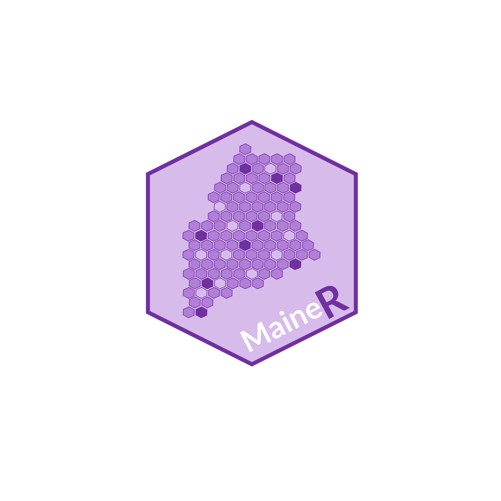

### Hello MaineRs!

The Greater Portland R User Group was initially founded in 2018 as a way to bring the R Users of Portland Maine together. With the hopes of becoming a state-wide user group, we have renamed to the MaineR Users Group.

Get involved!

-   [Sign up to the email list](https://docs.google.com/forms/d/e/1FAIpQLSfYSteX0m-0YvK4L_IT0VC0WUTYhrc9SzcWK3wjxoomV0hRhg/viewform?usp=dialog), we send out emails mostly to remind people of events.

-   We typically meet the last Thursday of the month at Novare Res in Portland at 5:30. We're the table with the wooden R and all the hex stickers.

-   Sometimes we have a short virtual talk in the middle of the day leading up to the event. It's always nice to have something to talk about. Once the group gets large enough, the plan is to also have some events in LA, Bangor, and Bar Harbor.

-   We also have a [MeetUp group](https://www.meetup.com/maine-r-users-group/) and a [LinkedIn group](https://www.linkedin.com/groups/9579975/) but we are hoping to eventually totally migrate to the email list by the start of 2027.

The goal of this group is to explore and discuss R and how it is being used in data science, data analysis, visualization, data mining, predictive analytics, and beyond!

We welcome all levels of interest to attend. We've had

People of all levels are welcome to attend, from those just getting started with R and predictive modelling to experts using R every day. While the focus is on the R programming language, presentations / talks from other languages/ fields are more than welcome!

```{r echo=FALSE}



```