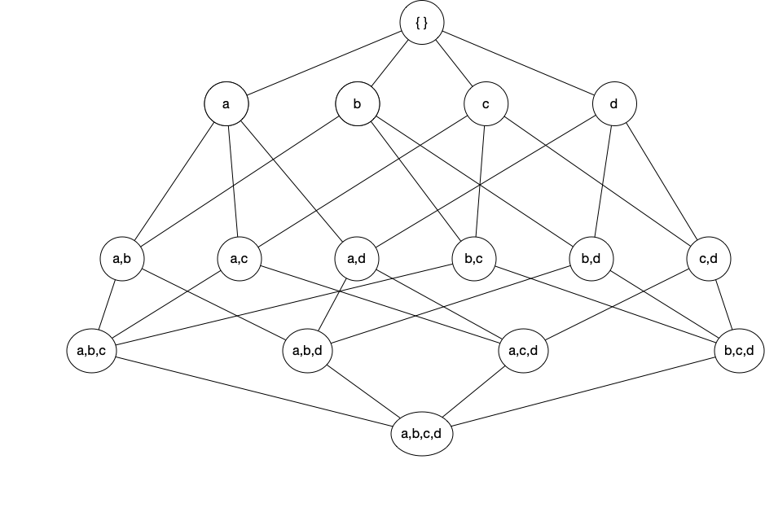
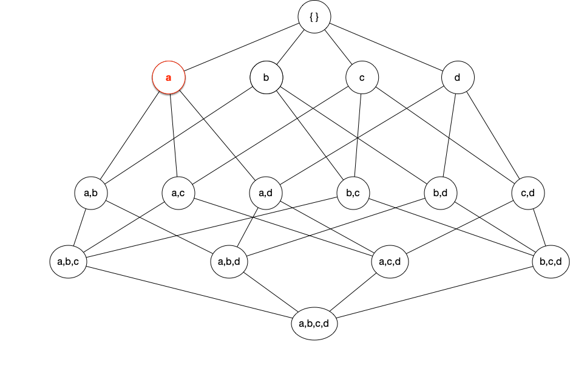
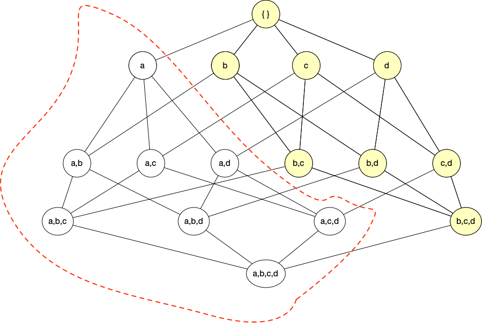
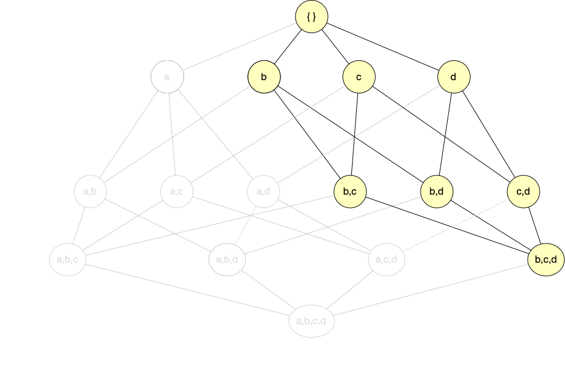
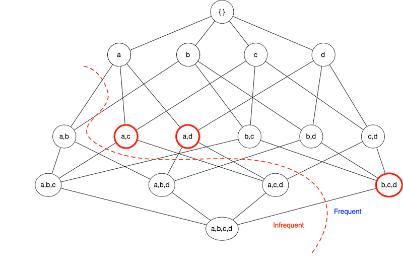
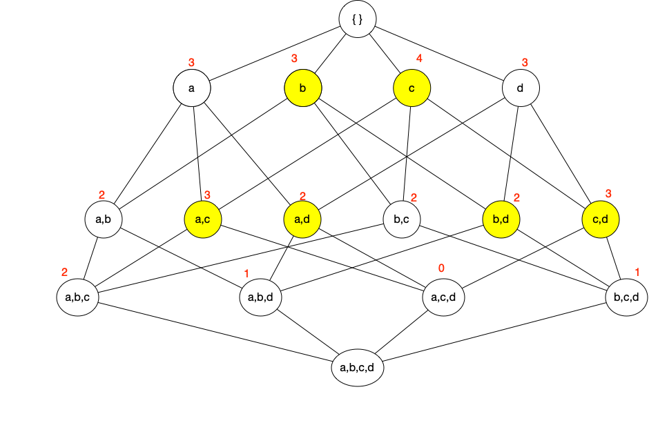

```{r setup, include=FALSE}
knitr::opts_chunk$set(echo = TRUE)

# ---------------------------------------------------------------------------- #
#                       | \ | |    /\     / ____|                              #
#                       |  \| |   /  \   | (___                                #
#                       | . ` |  / /\ \   \___ \                               # 
#                       | |\  | / ____ \  ____) |                              #
#                       |_| \_|/_/    \_\|_____/                               # 
# ---------------------------------------------------------------------------- #
# Project: Analysis of Modified Finnegan Neonatal Abstinence Syndrome          # 
# Purpose: Frequent Symptom Mining: neonatal abstinence syndrome (NAS)         #
#                                                                              #
# Methods/Analysis:                                                            #
#         Apriori  and ECLAT algorithm                                         #
#         Association Analysis (a.k.a. Market Basket Analysis)                 #
#                                                                              #                                                                     #
# Principal: Maine Medical Center, Maine Health                                #
#        PI: Margaret W Curran, M.D., Christina Holt, M.D.                     #
#        CO: Michael Arciero, Ph.D., James Quinlan, Ph.D.                      #
#                                                                              #
# Author:    James Quinlan                                                     #
# Modified:  2022-11-24                                                        #
# R version: 4.2.2 (2022-10-31)  -- "Innocent and Trusting"                    #
# ---------------------------------------------------------------------------- #
# idnlog5_nas: baby: QdY3%Goy*xPL

#' Research Questions
#'   1. Which symptoms are associated with "Treated"? With NAS >> 0?
#'   2. Which symptoms are frequent?
#'   3. Which symptoms frequently occur together?
#'   4. Is it more likely that babys' with NAS exhibit X and Y?
#' Look at the prethreshold data.  See if difference between treated and untreated
#' See if the same trend in terms of rules (#number of rules) 
#' Examine MBA by observation number, or groups of observations, e.g., 
#' observations 1 - 5, 6 - 10, 10 - 20, etc.  Are there hidden patterns among
#' these grouped observations?  

#' Method Questions
#'   1. What affect does removing items with low support count have?
#'   2. What affect does removing item(s) with HIGH support count?
#'   3. What is the affect of ....?
#'   4. Double check data.  Make sure values with 2+ counted.
#'   5. What items frequently go together subgrouped as:
#'      treated, untreated, all, prethreshold (each group)
#' 
#' Symptom Groupings
#' --------Central Nervous System-------- 
#'         Tremors_Disturbed	
#'         Tremors_Undisturbed	
#'         Excoriation	
#'         Myoclonic_Jerks	
#'         Moro_Reflex
#'         Increased muscle-tone
#' 
#' -------- Metavolic/vasomotor/respiratory -------- 
#'         Sweating	
#'         Yawning	
#'         Mottling:	blotches or patches on skin - sign of shock/stress
#'         Nasal_Stuffiness	
#'         Sneezing	
#'         Nasal_Flaring	
#'         Fever	
#'         Respiratory_Rate
#' 
#' -------- Gastrointestinal -------- 
#'         Excessive_Sucking	
#'         Vomiting	
#'         Stools
#'         Eating	
#' ----------------------------------------------------------------------------
```

## Quotes

* "In God we trust, all others bring data." - W. Edwards Deming

* "Data mining is not about finding the right answers, it's about asking the right questions." - Anonymous

* "Data mining is the process of finding needles in haystacks, and then finding the other needles that are hidden in those needles." - Anonymous

* "You didn't know?  You better call somebody!" - Road Dogg, WWE


## Outline

* Background of the Problem
* Background of the Method
* R packages
* Basic example(s)
* The crux of the matter
* Symptom mining


## 
##### Disclosure


## 
##### Background of the Problem 


<!-- FNAS -->

## Neonatal Abstinence Syndrome (NAS)

* In utero opiod exposure
* Characterized by withdrawal symptoms
* ICD-9 779.5
* ICD-10 P96.1
* Number of diagnoses increasing
* Control costs (lengthy stays)
* Detection is essential for health of infant
* Treatment is pharmacological therapy with morphine, methadone, or phenobarbital 


## Finnigan NAS Score (FNASS)

* 21 symptoms scored
* 5 gastronintesinal (e.g., vomit)
* 7 Centrial nerous system (e.g., tremors)
* 9 Respiratory (e.g., stuffiness, flaring)
* Scored every 4 hours
* Many scoring systems
  - Lipsitz (Lipsitz, 1975)
  - Neonatal Withdrawal Inventory (Zahorodny et al., 1998)
  - FNASS (Finnegan et al., 1975)


## Goal

* Reduce the number of items
* ESC (Curran et al., 2020)
* Mine frequent (assocaiated) symptoms


## Research Team

* Tina Holt, M.D., Maine Medical Center
* Meg Curran, M.D., Maine Medical Center
* Michael Arciero, Ph.D.  University of New England
* Curran, M., Holt, C., Arciero, M., Quinlan, J., Cox, D., & Craig, A. (2020). 
Proxy Finnegan component scores for eat, sleep, console in a cohort of opioid-exposed neonates. 
_Hospital Pediatrics, 10_(12), 1053-1058.


## 
##### Background of the Method 

## Itemset & Rule Mining

* Find (useful) patterns in a database
* *Frequent* co-occurrence
* Frequent Itemset Mining
* Sequence Mining
* Market Basket Analysis
  - Modern parlance


## Applications

* Retail sales (MBA)
* Web usage (data information brokers)
* Congressional Voting Records
* Law enforcement profiling
* Recommender systems
* Supply chain analysis
* Extract information hidden in DNA sequences
* Gene ontology 
* Concussion symptims (sleep, light sensitivity)


## Terminology

* **Items** are denoted by $\mathcal{I} = \{i_1, i_2, \dots, i_n \}$ and **transactions** (a.k.a. events, observations, records) as 
$T = \{t_1, t_2, \dots, t_N\}$ where $N > n$ and $N \gg 1$.
  - "Items" are *symptoms* in our case

* **Itemset** is any group of one or more items, also called **basket** or **cart**.
  - e.g., $X = \{ i_3, i_{17}, i_{1325} \}$

* **Frequent item set** is an itemset that meets (some) criteria.

* Let $X$ be a subset of items, then the __support count__ is the number of transactions
containing $X$. 
\[
\large{
\sigma(X) = | \{t_i | X \subset t_i \in T \}|
}
\]

* __Association Rule__ is an implication of the form $X \Rightarrow Y$ where $X \cap Y = \emptyset$.


## Measures of Strength and Interest

The following measure the strength of an association or frequency of an itemset.

* The **support** (how often the rule applies)
$$
\large{
S(X \Rightarrow Y) = \frac{\sigma(X \cup Y)}{N}
}
$$
where $N$ is the total number of transactions in the database.


<!-- given $X$, what's the probability $Y$? -->

* **Confidence** how frequently items in $Y$ appears in transactions that contain $X$.  
$$
\large{
C(X \Rightarrow Y) = \frac{\sigma(X \cup Y)}{\sigma(X)}
}
$$
 

* **Lift** (Brin et al., 1997), ratio of combined support from expected independence
$$
\large{
L(X \Rightarrow Y) = \frac{ N \sigma(X \cup Y)}{\sigma(X) \cdot  \sigma(Y)} = \frac{C(X,Y)}{S(Y)}
}
$$


## Example

<table style="width:80%">
   <tr>
    <td>1</td>
    <td>Milk</td>
    <td>Eggs</td>
    <td>Diapers</td>
    <td>Beer</td>
  </tr>
  <tr>
    <td>2</td>
    <td>Milk</td>
    <td></td>
    <td>Diapers</td>
    <td></td>
  </tr>
  <tr>
    <td>3</td>
    <td></td>
    <td>Eggs</td>
    <td>Diapers</td>
    <td>Beer</td>
  </tr>
  <tr>
    <td>4</td>
    <td>Milk</td>
    <td>Eggs</td>
    <td></td>
    <td></td>
  </tr>
  <tr>
    <td>5</td>
    <td>Milk</td>
    <td></td>
    <td>Diapers</td>
    <td>Beer</td>
  </tr>
</table>

Consider the transaction database with $X = \{ \text{Diapers} \}$ and $Y = \{\text{Beer}\}$.

* Support, $S(X,Y) = 3/5 = 0.6$
* Confidence,  $C(X,Y) = 3/4 = 0.75$
* Lift,  $L(X,Y) = (5 \cdot 3) / (4 \cdot 3) = 1.25$


## Binary Database

<table style="width:80%">
   <tr>
    <th>tid</th>
    <th>Milk</th>
    <th>Eggs</th>
    <th>Diapers</th>
    <th>Beer</th>
  </tr>
  <tr>
    <td>1</td>
    <td>1</td>
    <td>1</td>
    <td>1</td>
    <td>1</td>
  </tr>
  <tr>
    <td>2</td>
    <td>1</td>
    <td>0</td>
    <td>1</td>
    <td>0</td>
  </tr>
  <tr>
    <td>3</td>
    <td>0</td>
    <td>1</td>
    <td>1</td>
    <td>1</td>
  </tr>
  <tr>
    <td>4</td>
    <td>1</td>
    <td>1</td>
    <td>0</td>
    <td>0</td>
  </tr>
   <tr>
    <td>5</td>
    <td>1</td>
    <td>0</td>
    <td>1</td>
    <td>1</td>
  </tr>
</table>


## Rule Mining / Itemset Selection

* **Frequent item set** is an itemset that meets minimum support criteria.

* Given $d$ items, exclude the $0$ element set and the $d$ element set.
* For each subset $k$-element subset $X$, we consider the $d-k$ element subsets $Y$.
\[
\sum_{k = 1}^{d-1} \binom{d}{k}   \sum_{i = 1}^{d-k} \binom{d-k}{i} = 3^d - 2^{d+1} + 1 
\]
* Brute force is computationally prohibitive
  - Exponential time, $O(3^d)$
* Subset reduction needed
  - Apriori Algorithm


## Aprior Algorithm

* __Apriori Principle__:  If an itemset is frequent, then all its subsets are frequent.
* **Contrapositive**: If a subset is infrequent, then all its supersets are infrequent.  


<!-- Apriori Figures -->
##
<div align="center">

</div>


##
<div align="center">

</div>


##
<div align="center">

</div>


##
<div align="center">

</div>


 

<!-- end Figs. -->


## Compact representations  

<!--
Useful to identify a small representative set of frequent itemsets from which all other frequent itemsets can be derived.
-->

> **Definition**  -  A frequent itemset is **maximal** if none of its immediate supersets are frequent.

All frequent itemsets are a subset of the maximal itemsets.
<div align="center">

</div>


## Compact representations (cont)

> **Definition** -  An itemset $X$ is **closed** if none of its immediate supersets has exactly the same support count as $X$. An itemset is a **closed frequent itemset** if it is closed and its support is greater than or equal to minimum support.

<div align="center">

</div>


## Compact Representation Diagram

<div align="center">
 </div>


## 
##### R packages


<!-- R Packages -->


## R packages


* `aRules` - Mining Association Rules and Frequent Itemsets
  - Apriori and eclat algorithms
* `aRulesViz` - Visualize Association Rules
* `arulesSequences` - Mining Frequent Sequences
* `tidyverse` - Tidy ecosystem


## Install and Load

```{r, echo=FALSE, eval=FALSE}
# install.packages("tidyverse")
# install.packages("arules")
# install.packages("arulesViz")
# install.packages("arulesSequences")
# install.packages("arulesCBA")
# install.packages("arulesNBMiner")
# install.packages("arulesClassify")
```


```{r, echo=TRUE, results='hide', message=FALSE}
# install.packages("tidyverse")
# install.packages("arules")
# install.packages("arulesViz")
# install.packages("arulesSequences")

library(tidyverse)
library(arules)
library(arulesViz)
library(arulesSequences)
```


## aRules 1.7-5

* `inspect` - display rules in readable form
* `itemFrequency` -  Frequency/Support for Single Items
* `itemMatrix` - building block for transactions
* `apriori` - Mine frequent itemsets, association rules
* `eclat` - Mine frequent itemsets with the Eclat algorithm. 
  - equivalence class clustering along with bottom-up lattice traversal.
* `transactions` - subclass of `itemMatrix`.  Note: Data typically starts as a `data.frame` or a `matrix` and needs to be prepared before it can be converted into transactions
* Read the Manual
  - https://cran.r-project.org/web/packages/arules/arules.pdf
* Check dependencies (e.g., Matrix $\ge$ 1.4)


## Example
<!--
• "frequent itemsets"
• "maximally frequent itemsets"
• "generator frequent itemsets"
• "closed frequent itemsets"
• "rules" 
-->
```{r, echo=TRUE,  message=FALSE}
# Load Example Data (from aRules package)
data("Groceries")
class(Groceries)
```


## 
```{r}
head(as(Groceries, "data.frame"), 10)
```


## 
```{r, echo=TRUE}
freqItems <- apriori(Groceries, 
                 parameter = list(
                   supp   = 0.01, 
                   conf   = 0.5, 
                   target = "frequent itemsets", 
                   minlen = 3, 
                   maxlen = 5)
                 )
```

##
```{r}
head(as(freqItems,"data.frame") %>% arrange(desc(count)),10)
```


## 
```{r, echo=TRUE, results='hide'}
rules <- apriori(Groceries, 
                 parameter = list(
                   supp   = 0.01, 
                   conf   = 0.5, 
                   target = "rules", 
                   minlen = 1, 
                   maxlen = 10)
                 )
```


```{r}
head(as(rules,"data.frame") %>% arrange(desc(count)))
```


##
```{r, echo=TRUE}
summary(rules)
```


##
```{r, echo=TRUE}
inspect(rules[1:10], by ="lift")
```


## `arulesViz` 1.5-2

Visualizing Association Rules and Frequent Itemsets


* https://cran.r-project.org/web/packages/arulesViz/arulesViz.pdf
* `plot(rules, method="graph")`
* See also `ggraph` package for graph and network visualizations


## 

```{r}
plot(rules[1:10], method = "graph")
```


## Frequent Sequences

Mining frequent sequential patterns with the cSPADE algorithm

* SPADE (**S**equential **PA**ttern **D**iscovery using **E**quivalence classes)
* Temporal transactions (grouped by customer)
* "If a customer buys $X$ then in the next purchase will they buy $Y$"?
* Web logs ($a \to b \to c \to d$)
* `arulesSequences` 0.2-28
* `cspade(transactions)`


## 

```{r, results='hide',warning=FALSE}
# create binary matrix of items
data <- data.frame(sequenceID = as.factor(c(1, 1, 1, 1, 2, 2, 3, 4, 4, 4)),
                   eventID = as.factor(c(1, 2, 3, 4, 1, 1, 1, 1, 2, 3)),
                   A = c(0, 1, 1, 1, 1, 0, 1, 0, 0, 1),
                   B = c(0, 1, 1, 0, 1, 0, 1, 0, 1, 0),
                   C = c(1, 1, 0, 1, 0, 0, 0, 0, 0, 0),
                   D = c(1, 0, 0, 0, 0, 0, 0, 1, 0, 0),
                   E = c(0, 0, 0, 0, 0, 1, 0, 0, 0, 0),
                   F = c(0, 0, 1, 1, 1, 0, 1, 0, 0, 1),
                   G = c(0, 0, 0, 0, 0, 0, 0, 1, 1, 0),
                   H = c(0, 0, 0, 0, 0, 0, 0, 1, 0, 1))

db <- pivot_longer(data, cols = c(3,4,5,6,7,8,9,10)) %>% filter(value > 0)
```


##

```{r, results='hide',warning=FALSE}
sequences <- db %>%
  group_by(sequenceID, eventID) %>%
  summarize(
    SIZE = n(),
    items = paste(as.character(name), collapse = ';')
  )
names(sequences) = c("sequenceID", "eventID", "SIZE", "items")

sequences <- data.frame(lapply(sequences, as.factor))
sequences <- sequences[order(sequences$sequenceID, sequences$eventID),]

# Convert to transaction matrix data type
write.table(sequences, "seqs.txt", sep=";", row.names = FALSE, col.names = FALSE, quote = FALSE)
trans_matrix <- read_baskets("seqs.txt", sep = ";", info = c("sequenceID","eventID","SIZE"))
```

## 
```{r, echo=TRUE, results='hide'}
s1 <- cspade(trans_matrix, parameter = list(support = 0.6, maxlen=5), control = list(verbose = TRUE))
```

## 
```{r}
summary(s1)
```

##

```{r}
s1.df <- as(s1, "data.frame")
s1.df
```


## 
##### Crux

## Crux(es)

* Data frame must be converted to a **transaction**
* For `arulesSequences`
  - `pivot_longer`
  - `write_table`
  - `read_baskets`


## 
##### Symptom Mining


## Symptom Mining

```{r, echo=TRUE}
# read data
raw = read_csv('nas.csv', show_col_types = FALSE)

# clean
tidset = raw %>% mutate(Tremors = tremors_disturbed + tremors_undisturbed) %>%
          select(-c(tid, bid, oid, nas, num_items, tremors_disturbed, tremors_undisturbed, Tremors, tone))
```


```{r, results='hide'}
# df --> binary matrix --> transactions
transactions = as(ifelse(tidset > 0, 1, 0), "transactions")
```


```{r}
itemFrequency(transactions)
```

## 
```{r}
# Frequency Plots
itemFrequencyPlot(transactions,topN=10,type="absolute")
```


## Frequent Itemsets

```{r, results='hide'}
itemsets =  apriori(transactions, parameter = list(supp   = 0.03, 
                                                   conf   = 0.7,  
                                                   minlen = 3, 
                                                   target = "maximally frequent itemsets")
                    )
```


```{r}
inspect(itemsets, by = "lift")
```


## Frequent Rules

```{r, results='hide', warning=FALSE}
# Generate and Prune ASSOCIATION RULES
rules <- apriori(transactions, parameter = list(supp = 0.01, 
                                               conf = 0.70, 
                                               minlen = 1, 
                                               maxlen = 5, 
                                               target = "rules")
                )
sortedRules <- sort(rules, by="lift", decreasing=TRUE)
```


```{r}
summary(sortedRules)
```


## 
```{r}
inspect(sortedRules[1:10])
```


## 

```{r}
plot(sortedRules[1:10], method="graph")
```


## Frequent Symptom Sequences

```{r, results = 'hide', warning=FALSE}
seqDB <- raw %>% mutate(sequenceID = bid, eventID = oid) %>%
          select(-c(tid, bid, oid, nas, num_items, tremors_disturbed, tremors_undisturbed, tone))
seqDB <- pivot_longer(seqDB, c(1:17) ) %>% filter(value > 0)

sequences <- seqDB %>%
  group_by(sequenceID, eventID) %>%
  summarize(
    SIZE = n(),
    items = paste(as.character(name), collapse = ';')
  )
names(sequences) = c("sequenceID", "eventID", "SIZE", "items")
sequences <- data.frame(lapply(sequences, as.factor))
sequences <- sequences[order(sequences$sequenceID, sequences$eventID),]
```


##
```{r, results='hide', warning=FALSE}
write.table(sequences, "seqDB.txt", sep=";", row.names = FALSE, col.names = FALSE, quote = FALSE)
seq_mat <- read_baskets("seqDB.txt", sep = ";", info = c("sequenceID","eventID","SIZE"))

s1 <- cspade(seq_mat, parameter = list(support = 0.4, maxsize = 5), control = list(verbose = TRUE))
# PARAMETERS: 
# support: minimum support of a sequence (default 0.1).
# maxsize: (integer) max number of items of an element of a sequence (default 10).
# maxlen: (integer) max number of elements of a sequence (default 10).
# mingap: (integer) min time diff between consecutive elements of a sequence (default none, range >= 1).
# maxgap: (integer) max time diff between consecutive elements of a sequence (default none).
# maxwin: (integer) max time diff between any two elements of a sequence (default none.
```


##

```{r}
s1.df <- as(s1, "data.frame")
summary(s1)
```

##
```{r}
head(arrange(s1.df, desc(support)),30)
```


##
```{r}
# Get induced temporal rules from frequent itemsets
r1 <- as(ruleInduction(s1, confidence = 0.9, control = list(verbose = TRUE)), "data.frame")
head(r1)
```

